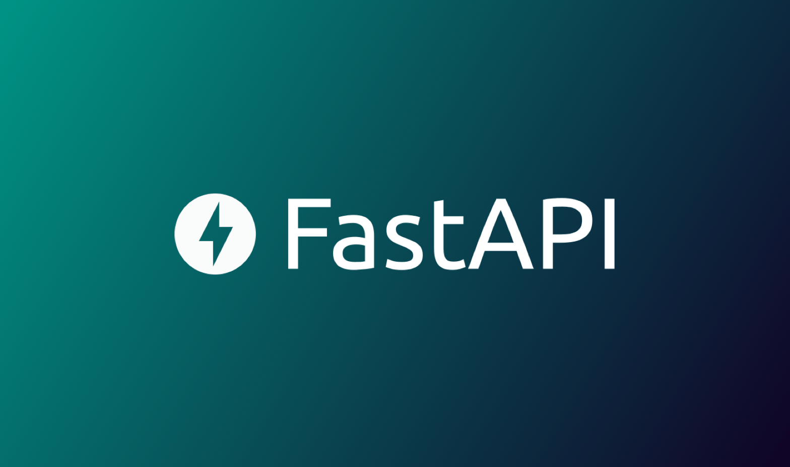

# RESTFULL-API сервис на FastAPI

Выполнено в двух вариациях - с обычными запросами (для использования шаблона с БД неподдерживающими async ([список бд, поддерживающих async](https://fastapi.tiangolo.com/advanced/async-sql-databases/))) и асинхронными запросами и бд.

[# ---- Ссылка на курс ---- #](https://www.youtube.com/watch?v=IZUjJ3rPY1E)

* База данных - Postgresql
* Используется JWT аутентификация, все пароли хешируются алгоритмом SHA-256
* Реализовано 2 таблицы: с товарами и с пользователями
* Хранение изображений - LargeByte
* Используются protected routes
* Настроенный группированный swagger

